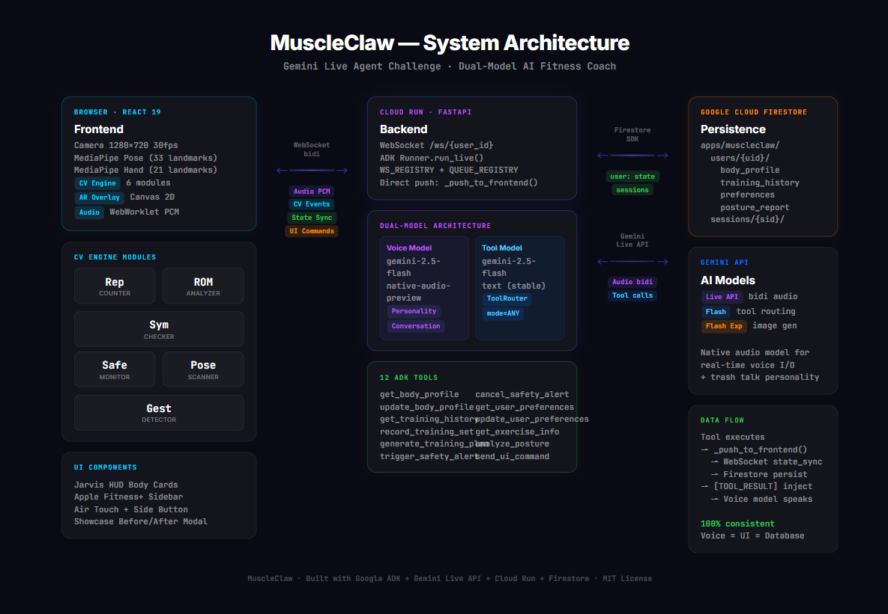

# MuscleClaw — AI Fitness Coach

> Like Jarvis, but for the gym. Real-time AI fitness coach with camera vision, voice interaction, gesture control, and AR overlays.

Built for the **Gemini Live Agent Challenge** using Google ADK + Gemini Live API.

**Live Demo:** https://muscleclaw-1058434722594.us-central1.run.app



## What it does

MuscleClaw is a real-time AI fitness coach that sees you, talks to you, and coaches you through your workout:

- **Sees you** — Camera + MediaPipe pose detection (33 landmarks at 30fps)
- **Talks to you** — Natural voice conversation with 3 personality modes
- **Counts your reps** — Automatic rep counting with ROM validation
- **Corrects your form** — Real-time joint angle analysis and symmetry checking
- **Keeps you safe** — Detects barbell stalls and triggers emergency countdown
- **Remembers you** — Persistent training history, body profile, strength data
- **Understands gestures** — Thumbs up, OK gesture, Air Touch (finger pointing as cursor)
- **Generates plans** — AI-generated training plans based on recovery status
- **Enhances photos** — Showcase mode with AI muscle enhancement (before/after)

## Dual-Model Architecture

MuscleClaw uses two Gemini models running in parallel for reliability and consistency:

| Model | Role | Reliability |
|-------|------|-------------|
| **gemini-2.5-flash-native-audio-preview** | Voice conversation, personality, real-time audio I/O | Natural voice |
| **gemini-2.5-flash** (text, stable) | Tool calling via ToolRouter with `mode=ANY` | ~100% tool execution |

The **ToolRouter** analyzes every user message, decides which tool to call, executes it directly, and injects the `[TOOL_RESULT]` back into the voice model's context. This ensures:
- Voice output always matches UI data (single source of truth)
- Tool calls execute reliably regardless of audio model behavior
- Frontend data updates are instant and consistent

## Tech Stack

| Layer | Technology |
|-------|-----------|
| Frontend | React 19 + TypeScript + Vite |
| Computer Vision | @mediapipe/tasks-vision (Pose 33pt + Hand 21pt) |
| AR Rendering | Canvas 2D + Jarvis HUD cards (CSS + inline SVG) |
| Audio | Web Audio API (AudioWorklet PCM capture + playback) |
| State | Zustand (4 stores) |
| AI Framework | Google ADK (Agent Development Kit) |
| Voice Model | Gemini 2.5 Flash Native Audio (Live API bidi-streaming) |
| Tool Model | Gemini 2.5 Flash (text, forced function calling) |
| Image Gen | Gemini 2.0 Flash Exp (Showcase muscle enhancement) |
| Backend | FastAPI + WebSocket |
| Persistence | Google Cloud Firestore |
| Deployment | Google Cloud Run |

## Features

### Core
- **Jarvis Voice Coach** — Natural voice conversation with personality modes (Trash Talk / Gentle / Professional)
- **Real-time Rep Counting** — Angle-based detection with ROM validation
- **Safety Guardian** — Barbell stall detection with emergency countdown + contact call
- **Persistent Memory** — Training history, body profile, preferences in Firestore

### AR & Interaction
- **Jarvis HUD Body Cards** — Holographic floating cards anchored to body landmarks with glow effects, corner brackets, scan lines
- **Air Touch** — Point your finger at the screen as a cursor, dwell-click to interact
- **Side Button** — Quick sidebar toggle from camera view
- **Gesture Control** — Thumbs up / OK for hands-free interaction

### AI-Powered
- **Training Plan Generation** — AI analyzes recovery status, recommends exercises, generates plans with scientific rationale
- **Showcase Mode** — AI muscle enhancement: capture a photo, Gemini generates a muscular version (before/after)
- **Posture Analysis** — Shoulder tilt, pelvic tilt, forward head detection with improvement suggestions

### Data & Visualization
- **Apple Fitness+ Dashboard** — Activity rings, PR records, training heatmap, form quality metrics
- **Weight Progression Curves** — SVG line charts per exercise
- **Training Calendar** — 30-day activity heatmap

## Personality Modes

| Mode | Voice | Style | Example |
|------|-------|-------|---------|
| **Trash Talk** (default) | Charon | Roasts you then coaches you | "Nah that doesn't count! My grandma extends further!" |
| Gentle | Kore | Warm encouragement | "Great form! Just extend a tiny bit more..." |
| Professional | Puck | Clinical data-driven | "Set 3 complete. Rest 120 seconds." |

Every roast is followed by specific professional coaching advice. Safety alerts override personality instantly.

## Getting Started

### Prerequisites
- Node.js 22+
- Python 3.12+ (uv recommended)
- Google API Key with Gemini access

### Local Development

```bash
# Backend
cd backend
cp .env.example .env  # Add GOOGLE_API_KEY
uv venv && uv pip install -r requirements.txt
uvicorn app:app --reload --port 8080

# Frontend (separate terminal)
cd frontend
npm install
npm run dev
```

Open http://localhost:5173 — allow camera and microphone access.

### Reproducible Testing

The repo includes two repeatable test paths: a local smoke test and a hosted end-to-end WebSocket test.

#### 1. Local smoke test

Start the backend and frontend with the commands above, then verify:

```bash
curl http://localhost:8080/health
curl http://localhost:8080/api/exercises
```

Expected results:

- `/health` returns `{"status":"ok","agent":"muscleclaw"}`
- `/api/exercises` returns a JSON exercise list
- Opening `http://localhost:5173` prompts for camera and microphone access
- Saying "show my body profile" triggers a spoken reply and opens the dashboard

#### 2. Hosted end-to-end test

This test hits the public Cloud Run deployment and verifies WebSocket connection, audio replies, tool routing, and UI command delivery.

```bash
cd backend
uv pip install -r requirements.txt
python e2e_test.py
```

The script reports pass/fail checks for connection stability, voice reply flow, training-plan generation, body-profile lookup, training-set recording, and preference updates.

#### 3. Maintainer-only Firestore persistence check

If you have `gcloud` access to the project, run the extended test suite:

```bash
cd backend
uv pip install -r requirements.txt
python test_e2e.py
```

This version additionally validates that user state was persisted to Google Cloud Firestore.

### Deploy to Cloud Run

```bash
gcloud run deploy muscleclaw \
  --source . \
  --region us-central1 \
  --allow-unauthenticated \
  --set-env-vars "GOOGLE_API_KEY=YOUR_KEY,GCP_PROJECT=YOUR_PROJECT" \
  --memory 1Gi \
  --port 8080
```

### Automated Cloud Deployment

You can deploy the app to Google Cloud Run from the repo root with the included script:

```bash
PROJECT_ID=your-gcp-project GOOGLE_API_KEY=your-key ./deploy/deploy-cloud-run.sh
```

The script enables the required Google Cloud services and performs a source-based Cloud Run deployment with the required environment variables.

### Reset Demo Data

```bash
cd backend && python seed_data.py
```

## Google Cloud Services Used

| Service | Purpose |
|---------|---------|
| **Cloud Run** | Hosts the full application (frontend + backend) |
| **Firestore** | Persistent user data (body profile, training history, preferences) |
| **Gemini Live API** | Real-time bidi audio streaming for voice conversation |
| **Gemini Flash** | Reliable tool calling via ToolRouter |
| **Gemini Flash Exp** | Image generation for Showcase mode |

## License

MIT
